# Spectrum - Full-Stack Blogging Platform | Spring Boot & React.js

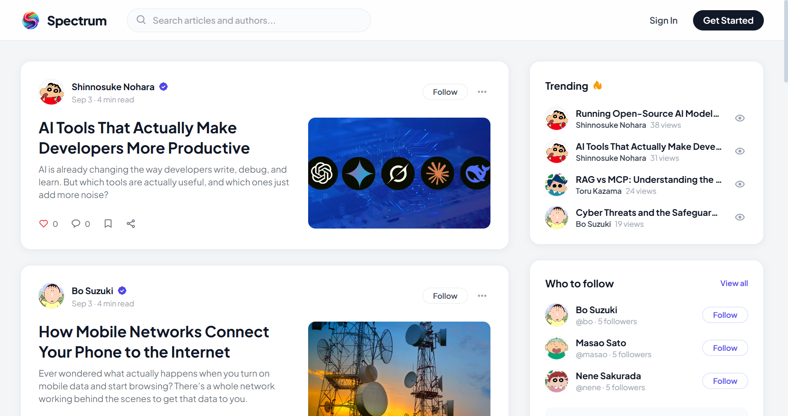

<p align="center">
 A full-stack blogging platform built with Spring Boot, Java 21, React.js, TypeScript, JWT, MySQL, and AWS (EC2, RDS, S3, CloudFront), featuring secure authentication, article management, user profiles, social engagement, notifications, search, and personalized feeds.
</p>

<p align="center">
  
  
  
  
  
  
  
</p>

---

## Overview

Spectrum is an end-to-end editorial and blogging platform designed for content creators, engineering publications, and collaborative readers. It delivers a fluid reading experience, a modular block-based story editor, personalized discovery feeds, social engagement mechanisms, and comprehensive account customization.

---

## Key Capabilities

### Discovery and Curation
- Dynamic feed shuffling providing randomized story presentation on each visit.
- Multi-tab feed switching between general discovery ("For You") and author-specific updates ("Following").
- Live trending algorithms displaying most-viewed articles.
- Contextual author recommendation widget with follow/unfollow capabilities.

### Editorial and Publishing Suite
- Modular block editor supporting paragraphs, subheadings, blockquotes, key takeaways, and image inserts.
- Direct image uploading to Amazon S3 integrated with CloudFront distribution.
- Automated client-side draft auto-save to local storage preventing content loss.
- Custom cover image uploads with caption metadata and tag attribution.

### Community and Reader Engagement
- Article engagement suite including likes, bookmarks, and social sharing links.
- Interactive reader discussion threads with real-time additions and removals.
- Dynamic author cards displaying bios, follower stats, and related publications.
- Integrated notification center tracking reader interactions and follower activity.

### Customization and User Profiles
- Public author profile pages featuring custom headers, avatars, follower statistics, and published catalogs.
- Self-service account configuration including display name, username, bio, and social handles (GitHub, X, LinkedIn, personal website).
- Privacy toggles for public vs. private profile indexing.
- System-wide appearance preferences supporting Light Mode, Dark Mode, and OS-level System Mode.

### Security and Architecture
- Stateless JWT authentication with secure password hashing.
- Automated cache and theme persistence cleanup upon user sign-out.
- Centralized asynchronous request interception and standardized error reporting via React Toastify.

---

## Platform Walkthrough

### 1. Discovery Feed (Guest View)
Unauthenticated users are presented with a curated discovery feed, trending topics, and suggested writers.


---

### 2. User Authentication - Sign In
Modal authentication interface supporting email and password credentials with real-time validation.

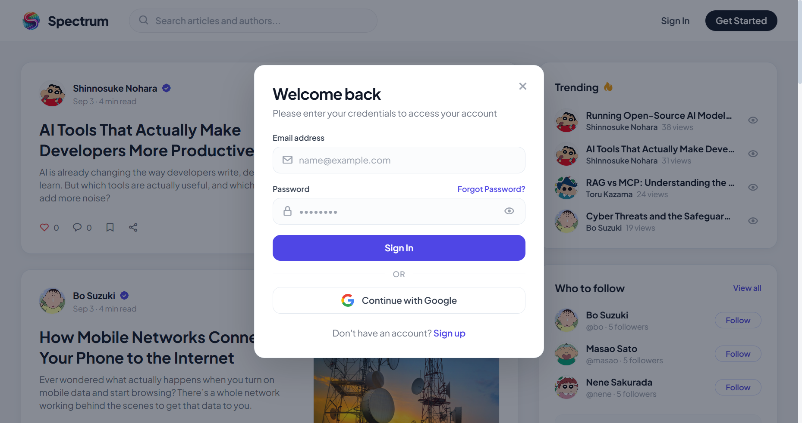

---

### 3. User Authentication - Registration
Registration dialog for new members to create an account and join the platform.

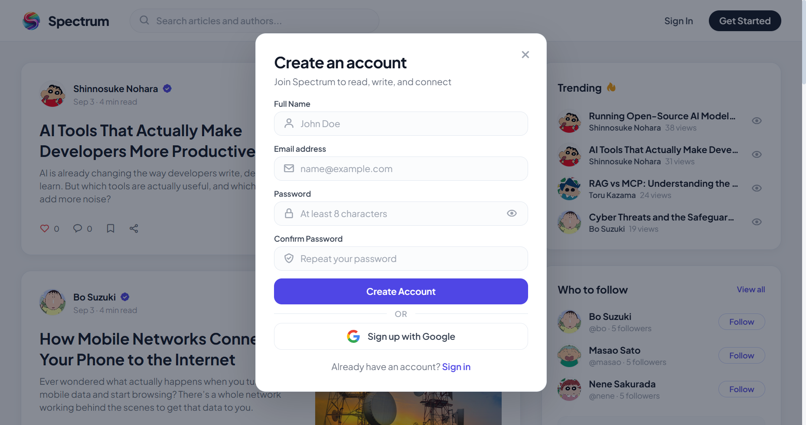

---

### 4. Authenticated Home Feed
Logged-in users gain access to tabbed feeds ("For You" and "Following"), writer navigation, and profile shortcuts.

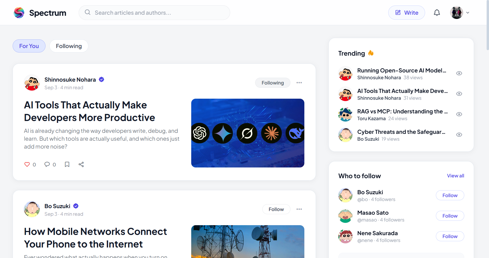

---

### 5. Story Creation and Block Editor
Dedicated editorial environment supporting multi-type content blocks, live word count, reading time estimates, cover image uploads, and draft states.

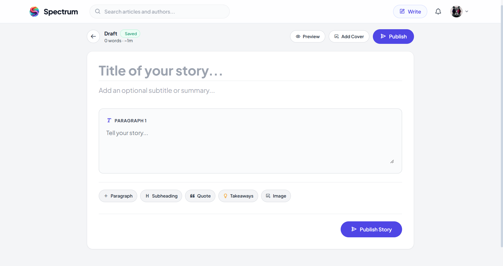

---

### 6. Article Reading View
Distraction-free article interface featuring reading progress indicators, section navigation pills, embedded media, and author highlights.

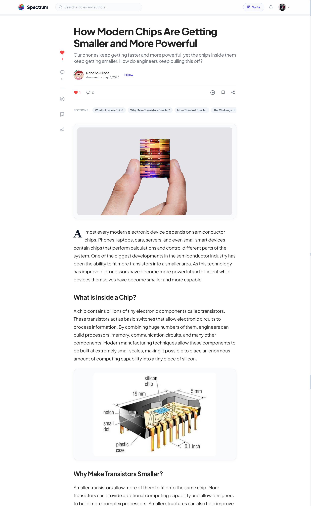

---

### 7. Discussion and Reader Responses
Threaded commentary section allowing readers to share thoughts, leave feedback, and interact with the author.

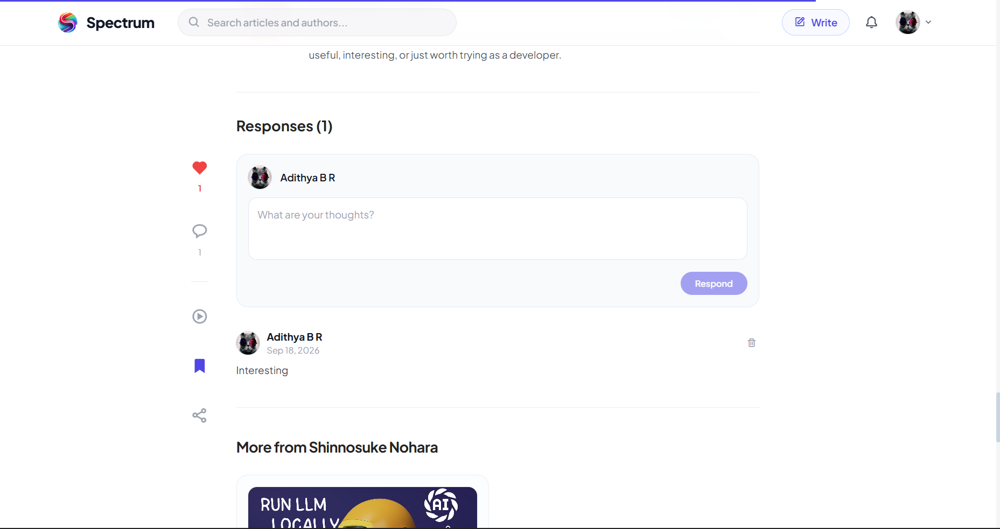

---

### 8. Public Author Profile
Public profile page displaying an author's cover banner, avatar, biography, social links, metrics, and published catalog.

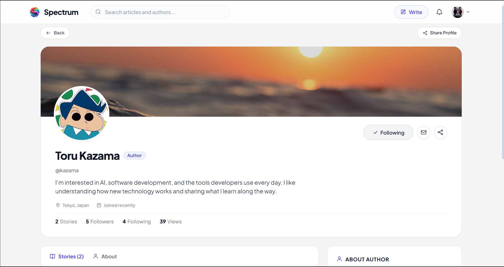

---

### 9. Account Identity Settings
Profile settings allowing creators to update their full name, handle, bio, avatar, and banner imagery.

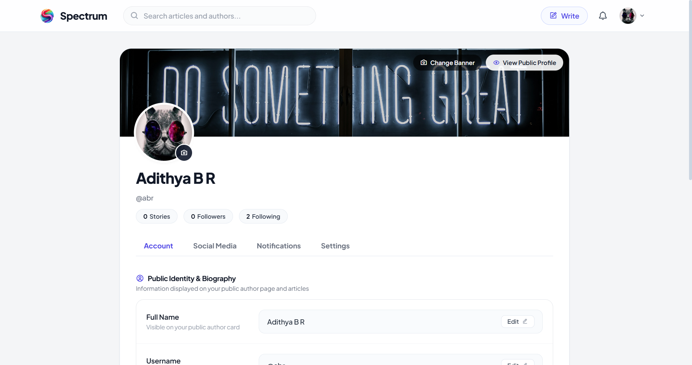

---

### 10. Connected Social Links
Configuration interface for external social media profiles, including Twitter / X, GitHub, LinkedIn, and personal domains.

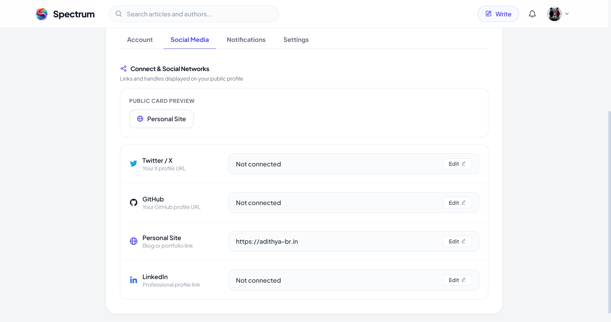

---

### 11. Profile Appearance and Privacy Settings
Preferences pane for setting profile discoverability (Public vs. Private) and selecting theme modes (Light, Dark, System).

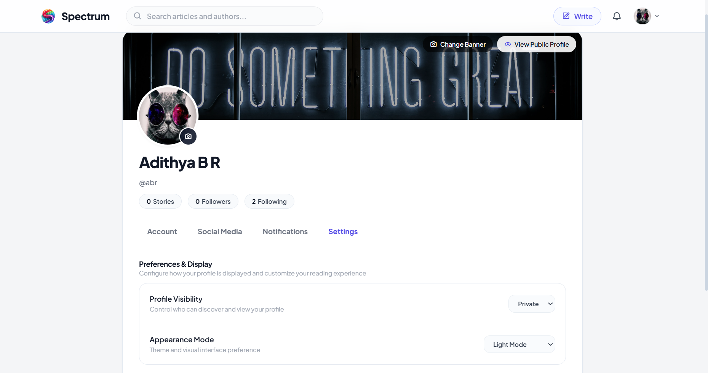

---

### 12. Notification Center
Unified notifications center tracking follower additions, post likes, and comments with filtering and bulk actions.

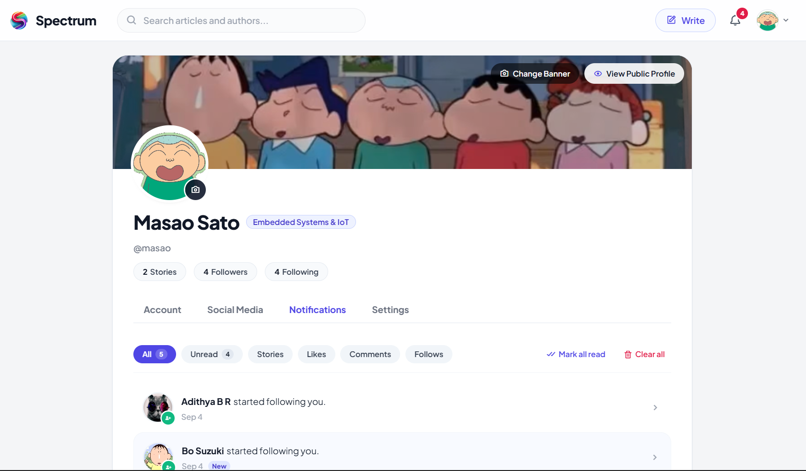

---

### 13. Saved and Liked Stories
Dedicated reader archive storing bookmarked articles and liked stories for future reference.

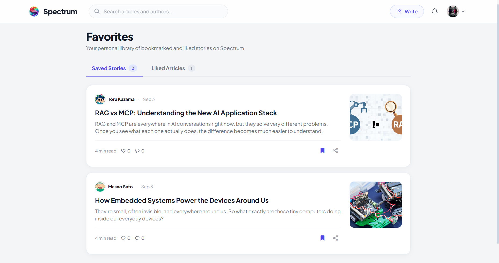

---

### 14. Stories and Drafts Management
Author management dashboard displaying article status (Published vs. Archived), lifetime view counts, and editing actions.

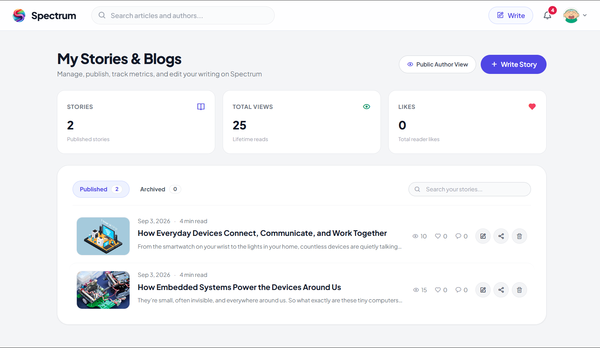

---

### 15. Search and Topic Discovery
Search interface supporting real-time querying across article titles, content tags, and author profiles.

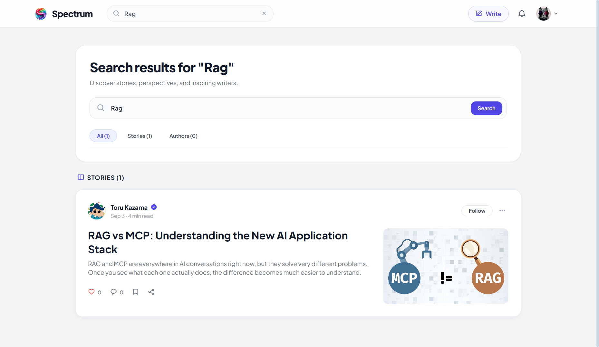

---

## Technical Architecture

### Backend Stack
| Layer | Technology | Specification |
| :--- | :--- | :--- |
| Runtime | Java | Version 21 LTS |
| Framework | Spring Boot | Version 4.1.1 |
| Persistence | Spring Data JPA / Hibernate | Object-Relational Mapping |
| Security | Spring Security + JJWT | Stateless JWT Authentication |
| Database | MySQL | Version 8.0+ |
| Cloud Storage | AWS SDK v2 (S3) + CloudFront | Object Storage and CDN Delivery |
| Data Mapping | ModelMapper | Entity to DTO Conversion |

### Frontend Stack
| Layer | Technology | Specification |
| :--- | :--- | :--- |
| Framework | React | Version 18.3 |
| Language | TypeScript | Version 5.6 |
| Build Tool | Vite | Fast HMR and Bundling |
| Styling | Tailwind CSS | Utility-first CSS with Dark Mode |
| Routing | React Router DOM | Client-side Single Page Navigation |
| State & Client | Context API + Axios | Authentication & API Integration |
| Notifications | React Toastify | Toast Feedback System |
| Icons | Boxicons | Vector Iconography |

---

## Getting Started

### Prerequisites
- Java Development Kit (JDK) 21
- Node.js 18.x or higher with npm
- MySQL Server 8.0+
- (Optional) Amazon Web Services account with configured S3 bucket

---

### 1. Database Initialization
Create a dedicated MySQL database:

```sql
CREATE DATABASE spectrum_blog CHARACTER SET utf8mb4 COLLATE utf8mb4_unicode_ci;
```

---

### 2. Backend Configuration

1. Set your environment variables or adjust `src/main/resources/application.properties`:

```properties
spring.datasource.url=jdbc:mysql://localhost:3306/spectrum_blog?createDatabaseIfNotExist=true
spring.datasource.username=your_database_username
spring.datasource.password=your_database_password
jwt.secret=your_secure_256_bit_jwt_secret_key
aws.s3.bucket-name=spectrum-blog
aws.s3.region=us-east-1
aws.cloudfront.domain=https://your-cloudfront-distribution.net
```

2. Start the Spring Boot service:

```bash
# Unix/macOS
./mvnw spring-boot:run

# Windows
.\mvnw.cmd spring-boot:run
```

The service will bind to `http://localhost:8080`.

---

### 3. Frontend Configuration

1. Change directory to the client application:

```bash
cd client
```

2. Establish environment parameters by duplicating `.env.example`:

```bash
cp .env.example .env
```

Ensure the API base path points to your running backend:

```env
VITE_API_URL=http://localhost:8080
```

3. Launch the development server:

```bash
npm run dev
```

The web client will be accessible at `http://localhost:5173`.

---

## Demo Credentials

For testing authentication, profiles, and publishing workflows locally:

| Role | Email | Password |
| :--- | :--- | :--- |
| Demo User | `abr@gmail.com` | `abr@gmail.com` |

---

## Directory Organization

```text
spectrum_blog/
├── client/                     # React + TypeScript client application
│   ├── public/                 # Static assets
│   ├── src/
│   │   ├── components/         # Shared UI components, modals, and navigation
│   │   ├── context/            # React context providers (AuthContext)
│   │   ├── pages/              # Primary route views (Home, Blog, Profile, Write)
│   │   ├── services/           # Axios client configurations and API methods
│   │   └── utils/              # Helper utilities and theme handlers
│   ├── index.html
│   ├── package.json
│   ├── tailwind.config.js
│   └── vite.config.ts
├── docs/
│   └── screenshots/            # High-resolution platform documentation screenshots
├── src/                        # Spring Boot backend source code
│   ├── main/
│   │   ├── java/in/adithyabr/spectrum_blog/
│   │   │   ├── config/         # Security, CORS, S3, and JWT configurations
│   │   │   ├── controller/     # REST controllers
│   │   │   ├── dto/            # Data Transfer Objects
│   │   │   ├── entity/         # JPA entity models
│   │   │   ├── repository/     # Data repositories
│   │   │   └── service/        # Business logic services
│   │   └── resources/
│   │       └── application.properties
│   └── test/                   # Backend automated test suites
├── pom.xml                     # Maven project descriptor
├── LICENSE                     # Custom Attribution License
└── README.md
```

---

## License

This project is licensed under a Custom Attribution License. See [LICENSE](LICENSE) for terms and attribution requirements.
